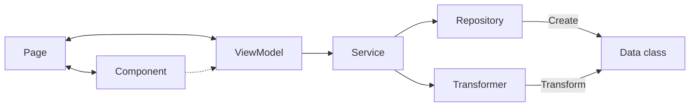

# flutter_template

My personal template when starting a new flutter project

## Folders

### Components

Components are used to store small widget that can be reused by any page or dialog of the app.

They can be either :
- An atom : A small widget
- A molecule : A widget containing other atoms

If a component behavior become too big, there should be a ViewModel with it

### Model

The model contains every data class and the core concept of the Model-View-ViewModel.

### Pages

Pages contains every pages of the app. It's a screen the user will see containing components and specific widget

Every pages should at least have a ViewModel.

### Repositories

Every repository give you a way to retrieve data and create data class with it. They can only be called from Services.

### Services

Every services helps you calling repositories and transformers to retrieve data as you want;

### Transformers 

Transformers let you transform data, from one class to an another. They can only be called from Services.

### Utils

Utils contain every extensions for the project. It can be extensions for base class (e.g. string, int, boolean) and for specific classes too.

## Diagram

